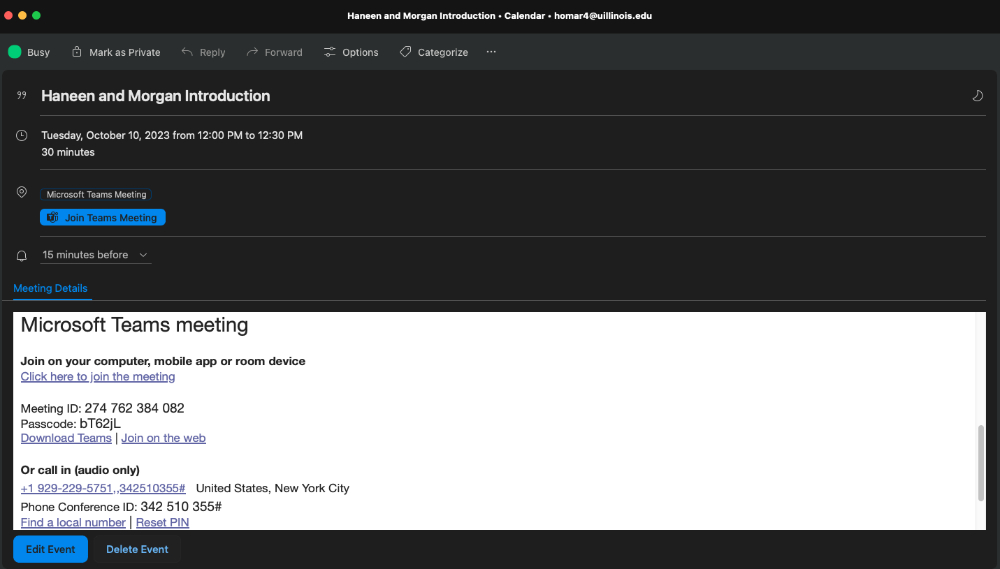

# Setup Your Calendar 📅
In this lesson, you will learn how to set up and manage your calendar, a crucial skill in any workplace. Setting up your calendar on various platforms (desktop, mobile) with notifications enabled will ensure you stay on top of important events and deadlines. Monitoring your calendar frequently is essential for effective time management and professional success.

## Why Calendar Management is Important
Calendars are essential for organizing your schedule, keeping track of meetings, deadlines, and other important events. Proper calendar management can enhance your productivity, ensure you don't miss important appointments, and help you maintain a professional image.

## Steps to Set Up Your Calendar

### Choose a Calendar Client
- Desktop Clients: Microsoft Outlook, Apple Calendar. For DPI, **we recommend using Outlook**.
- Web Clients: Examples include Google Calendar, Outlook.com.
- Mobile Clients: Most smartphones come with built-in calendar apps. You can also download third-party apps like Google Calendar, Outlook, or Fantastical.

### Add Your Calendar Feed

#### Canvas Calendar
Canvas has a built-in calendar feature that aggregates events, assignments, etc., from all your courses.
1. Navigate to the Calendar section in Canvas.

2. Copy the calendar feed URL.

### Subscribe to the Calendar Feed
3. Open [Outlook](mail.outlook.com) and go to the Calendar section.

4. Choose to add a new calendar by URL.

5. Paste the Canvas calendar feed URL.

## Share Your Calendar
- Don’t just throw a meeting on someone’s calendar. Use shared calendars to see if someone is free or ask!

- Share your calendar with your team to coordinate meetings and events.

- Use the `+` button to look up the person you want to share your calendar with.

- Select the individual and the level of permission you want to give them, then press `Add`

## Create a meeting
1. Click on `New Event` to create a new meeting.

2. Add the meeting details, including the title, date, time, location, and attendees. You can also set up a recurring meeting if needed.

3. If you want to add a virtual meeting, toggle `Teams meeting` if you are using Teams. If you want to add a Zoom meeting, you need to install the Zoom add-in, or manually add a Zoom link.

4. Example of a meeting event. 

Tip: try to avoid lunch time meetings, unless of course it's a meeting over lunch.

<!-- 
-----------recommending outloook. maybe hook outlook into calendar client?-------------

Option B: Apple Calendar
Open Apple Calendar.
Go to File > New Calendar Subscription.
Paste the Canvas calendar feed URL.

Configure Calendar Refresh:

Set the calendar subscription to auto-refresh at least every 15 minutes to ensure you always have an accurate calendar. 
-->

### Enable Notifications

Ensure notifications are enabled for upcoming events.
Customize notification settings to avoid unnecessary distractions (e.g., notify 15 minutes before an event).

### Monitor Your Calendar Frequently

Check your calendar at the beginning and end of each day.
Regularly update events and deadlines to keep your schedule current.

## Quiz
- Why is it important to set up a calendar client on multiple devices?
- It makes it easier to monitor events and deadlines.
  - Correct! Monitoring your calendar across devices ensures you don't miss important appointments.
- It is required by most companies.
  - Not quite. While not always required, it's a best practice for staying organized.
- It improves the battery life of your devices.
  - Not correct. Setting up a calendar on multiple devices does not impact battery life.
{: .choose_best #importance title="Importance of Setting Up Calendar" points="1" answer="1"}

- What should you do to ensure you have an accurate calendar?
- Check your calendar once a week.
  - Not correct. Checking your calendar frequently is essential for staying on top of your schedule.
- Enable notifications for upcoming events.
  - Correct! Notifications help you stay informed about upcoming events.
- Set the calendar subscription to auto-refresh every hour.
  - Close. Setting it to refresh more frequently, like every 15 minutes, is better.
{: .choose_best #notifications title="Calendar Notifications" points="1" answer="2"}

- Organizing your calendar with categories and colors can help keep your schedule more manageable.
- True
  - Correct! Organizing your calendar can help you stay on top of important events and deadlines.
- False
  - Not correct. Organization is key to effective calendar management.
{: .choose_best #organization title="Calendar Organization" points="1" answer="1"}

- Have you subscribed to the Canvas calendar feed?
- Yes
  - Great! Now you'll be up to date with the latest class meetings and assignment due dates.
- No
  - Please subscribe to the Canvas calendar feed before advancing.
{: .choose_best #subscribed title="Subscribe to the Canvas calendar" points="1" answer="1"}

## Follow Up Assignment
<!-- 
Create a New Recurring Meeting and add TA
Share your calendar with a TA
-->

Schedule a meeting with a TA with the subject line: “Setup my calendar" using their calendly to confirm that you have successfully set up your calendar.